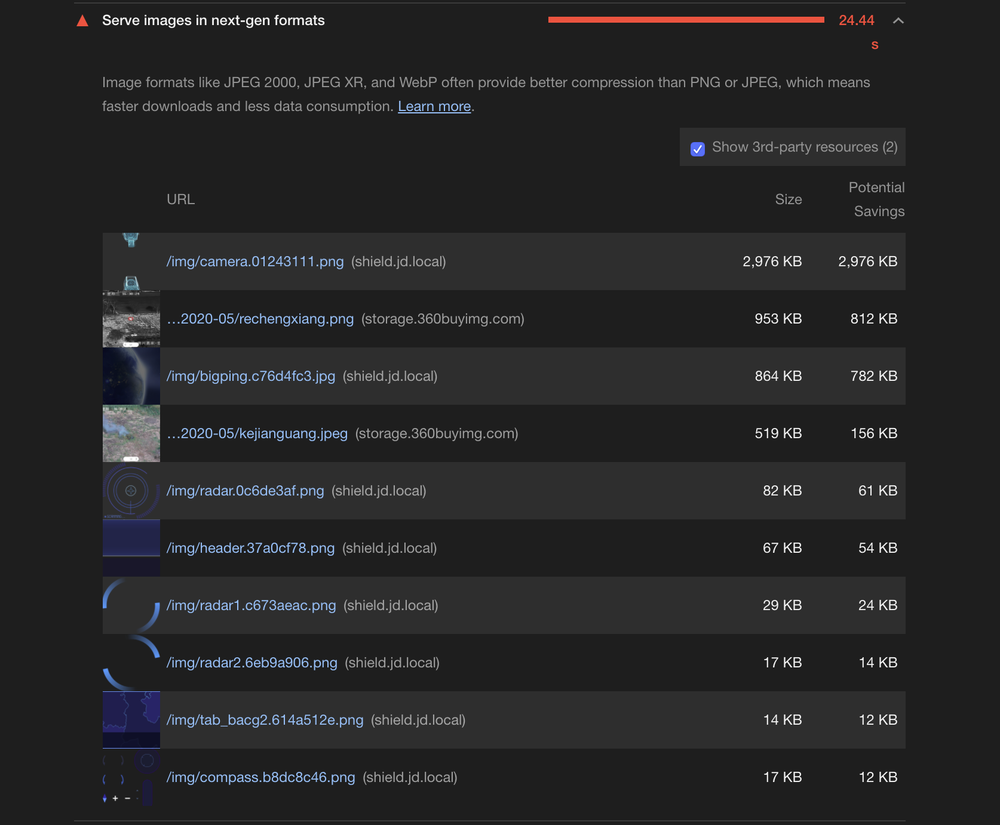

##### 故事背景
在做页面加载优化的时候，发现有提醒将png图片转换成以下格式的图片，将会有更快的下载速度和更少的数据消耗。因此我想查一下各种图片之间的区别是什么。

#### PNG
是一种无损数据压缩图片，有8位、24位、32位三种形式。其中8位支持两种形式的透明（索引透明和alpha透明），24位不支持透明，32位可展现256级透明程度。
优点 　　
    * 支持256色调色板技术以产生小体积文件 　　
    * 最高支持48位真彩色图像以及16位灰度图像。 　　
    * 支持Alpha通道的半透明特性。 　　
    * 支持图像亮度的gamma校正信息。 　　
    * 支持存储附加文本信息,以保留图像名称、作者、版权、创作时间、注释等信息。 　　
    * 使用无损压缩。 　　
    * 渐近显示和流式读写,适合在网络传输中快速显示预览效果后再展示全貌。 　　
    * 使用CRC循环冗余编码防止文件出错。 　　
    * 最新的PNG标准允许在一个文件内存储多幅图像。 
缺点 　　
    但也有一些软件不能使用适合的预测,而造成过分臃肿的PNG文件。

#### JPG
使用的是失真压缩标准方法，内容比GIF丰富，不支持动画，不支持透明。JPEG的压缩方式通常是破坏性资料压缩，意即在压缩过程中图像的品质会遭受到可见的破坏。一张图片在多次上传下载之后会失真。
优点 　　
    JPEG/JFIF是最普遍在万维网（World Wide Web）上被用来储存和传输照片的格式。JPEG在色调及颜色平滑变化的相片或是写实绘画（painting）上可以达到它最佳的效果。在这种情况下,它通常比完全无失真方法作得更好,仍然可以产生非常好看的影像（事实上它会比其他一般的方法像是GIF产生更高品质的影像,因为GIF对于线条绘画（drawing）和图示的图形是无失真,但针对全彩影像则需要极困难的量化）。 
缺点
 　　它并不适合于线条绘图（drawing）和其他文字或图示（iconic）的图形,因为它的压缩方法用在这些图形的型态上,会得到不适当的结果；

#### PNG VS JPG
JPG VS PNG：JPG在图片压缩方面有巨大优势，但采用有损压缩，图片质量有损失。一般截屏用PNG格式不但比JPG质量高 且 文件还更小；
防锯齿PNG非常有优势。