[toc]

### 基础示例

1. 创建一个简单的画布

```html
<canvas id="canvas"></canvas>
```

2. 通过代码绘制画布，控制其展示形态。

```js
// 创建绘制环境
const canvas = document.getElementById('canvas');
const ctx = canvas.getContext('2d');

// 开始绘制内容
ctx.fillStyle = 'green';
ctx.fillRect(10, 10, 150, 100)
```

#### 栅格

在绘制canvas之前，需要了解一下画布的栅格以及坐标空间。canvas元素默认被网格覆盖，通常来说网格中的一个单元相当于canvas元素中的一像素。栅格的起点为左上角，坐标为（0，0），所有元素的位置都相对于原点定位。


### 绘制矩形

canvas只支持两种形式的图形绘制：矩形和路径(由一系列点连接承德线段)。所有其他类型的图形都是通过一条或者多条路径组合而成的，由多个路径而形成复杂图形。

```js
/**
* 绘制一个填充的矩形
* x 矩形起始点的 x 轴坐标。
* y 矩形起始点的 y 轴坐标。
* width 矩形的宽度。
* height 矩形的高度。
*/
fillRect(x, y, width, height)

// 绘制一个矩形的边框
strokeRect(x, y, width, height)

// 清除指定矩形区域，让清除部分完全透明
clearRect(x, y, width, height)
```

```html
<!DOCTYPE html>
<html lang="en">

<head>
    <meta charset="utf-8">
    <meta http-equiv="X-UA-Compatible" content="IE=edge">
</head>

<body>
    <canvas id="canvas"></canvas>
    <script>
				const canvas = document.getElementById('canvas');
				const ctx = canvas.getContext('2d');
				
				ctx.fillRect(25, 25, 100, 100);
				ctx.clearRect(45, 45, 60, 60);
				ctx.strokeRect(50, 50, 50, 50);
		</script>
</body>
</html>
```


### 绘制路径

图形的基本元素是路径，路径是通过不同颜色和宽度的线段或者曲线相连形成的不同形状的点的集合。一个路径，甚至一个子路径都是闭合的。使用路径绘制图形需要一些额外的步骤。
1、创建路径起始点
2、使用==画图命令==去画出路径
3、把路径封闭
4、一旦路径生成，就能通过描边或填充路径区域来渲染图形

需要用到的函数：

```js
beginPath() // 新建一条路径，生成之后，图形绘制命令被指向到路径上生成路径，ps：当想创建一条新的路径时，调用此方法。

closePath() // 闭合路径之后图形绘制命令又重新指向到上下文中

stroke() // 通过线条来绘制图形轮廓

fill() // 通过填充路径的内容区域生成实心的图形
```

第一步：当前路径为空，即调用beginPath()之后，或者canvas刚建的时候，第一条路径构造命令通常被视为是moveTo（），无论实际上是什么。出于这个原因，你几乎总是要在设置路径之后专门指定你的起始位置。
第二步：调用函数指定绘制路径
第三步：闭合路径closePath()，不是必须的，这个方法会通过绘制一条从当前点到开始点的直线来闭合图形。如果图形是已经闭合了的，即当前点为开始点，该函数什么也不做。
==注意：当你调用fill()函数时，所有没有闭合的形状都会自动闭合，所以你不需要调用closePath()函数。但是调用stroke()时不会自动闭合。==

### 绘制一个三角形

```HTML
<!DOCTYPE html>
<html lang="en">

<head>
    <meta charset="utf-8">
    <meta http-equiv="X-UA-Compatible" content="IE=edge">
</head>

<body>
    <canvas id="canvas"></canvas>
    <script>
				const canvas = document.getElementById('canvas');
				const ctx = canvas.getContext('2d');
				
				// 开始绘制三角形
				ctx.beginPath();
				ctx.moveTo(75, 50);
				ctx.lineTo(100, 75);
				ctx.lineTo(100, 25);
				ctx.fill();
		</script>
</body>
</html>
```

### 移动笔触 moveTo 函数

移动触笔也就是从一个点到另一个点的移动过程

```js
moveTo(x, y) // 将触笔移动到指定的坐标系点(x,y)上

/*
* startAngle 圆弧的起点，单位弧度
* endAngle 圆弧的重点，单位是弧度
* anticlockwise 可选参数 boolean 为true时是逆时针绘制，false时是顺时针绘制
*/
arc(x, y, radius, startAngle, endAngle, anticlockwise) // 绘制圆弧路径的方法，圆弧路径的圆心在(x, y)位置，半径为radius，根据anticlockwise(默认是顺时针)指定的方向从startAngle开始绘制，到endAngel结束。

```

当canvas初始化或者`beginPath()`调用后，你通常会使用`moveTo()`函数设置起点。我们也能够使用`moveTo()`来绘制一些不连续的路径，

绘制一个笑脸

```html
<!DOCTYPE html>
<html>
	<head>
		<meta charset="utf-8" />
		<title>笑脸</title>
	</head>
	<body>
		<canvas id="canvas"></canvas>
		<script type="text/javascript">
			const canvas = document.getElementById('canvas');
			const ctx = canvas.getContext('2d');
			ctx.beginPath();
			ctx.arc(75, 75, 50, 0, Math.PI * 2, true); // 绘制一个圆，以(75, 75)为圆心，50为半径，并且最终的画笔落在(125, 75)处
			ctx.moveTo(110, 75); // 移动画笔位置，准备画嘴巴。将画笔落到这个点位作为起点开始为下一笔的绘制做准备
			ctx.arc(75, 75, 35, 0, Math.PI, false); // 口(顺时针) 画一个半圆
			ctx.moveTo(65, 65); // 将画笔落到左眼的圆心处，开始画圆。
			ctx.arc(60, 65, 5, 0, Math.PI * 2, true); // 左眼
			ctx.moveTo(95, 65); // 将画笔落到右眼的圆心处，开始画圆。
			ctx.arc(90, 65, 5, 0, Math.PI * 2, true); // 右眼
			ctx.stroke();
		</script>
	</body>
</html>

```

| 画笔的运行轨迹                       | 最终效果                                                     |
| ------------------------------------ | ------------------------------------------------------------ |
|  | 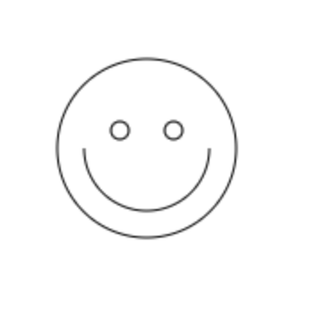 |

### 绘制线 lineTo函数

```js
lineTo(x, y); // 绘制一条从当前位置（也即是当前的画笔）到指定x以及y位置的直线
```
> 该方法有两个参数x和y，代表坐标系中直线结束的点。开始点和当前的绘制路径有关，之前路径的结束点就是接下来的开始点，当然开始点也可以使用moveTo函数来改变。

使用线段绘制两个三角形
```html
<!DOCTYPE html>
<html>
	<head>
		<meta charset="utf-8" />
		<title>展示lineTo函数</title>
	</head>
	<body>
		<canvas id="canvas"></canvas>
		<script type="text/javascript">
			function draw() {
				var canvas = document.getElementById('canvas');
				if (canvas.getContext) {
					var ctx = canvas.getContext('2d');

					// 填充三角形
					ctx.beginPath();
					ctx.moveTo(25, 25); // 设置画笔的位置
					ctx.lineTo(105, 25); // 绘制一条线段，从点(25, 25)到(105, 25)
					ctx.lineTo(25, 105); // 继续绘制线段到(25, 105)位置
					ctx.fill(); // 注意此处不需要调用closePath()函数，因为fill()会自动关闭路径

					// 描边三角形
					ctx.beginPath();
					ctx.moveTo(125, 125);
					ctx.lineTo(125, 45);
					ctx.lineTo(45, 125);
					ctx.closePath();
					ctx.stroke(); // 描边是无法自动关闭路径的，所以需要调用closePath()函数来进行关闭
				}
			}
			draw()
		</script>
	</body>
</html>
```


### 圆弧 arc函数

上面的笑脸示例中已经写过arc的具体参数内容，所以这里不做赘述。另外画圆弧还有一个arcTo()函数，。
```js
arcTo(x1, y1, x2, y2, radius); // 根据指定的控制点和半径画一段圆弧，再以直线连接两个控制点
```

画一些圆（==注意画布的大小以及相关特性==）

> `<canvas>` 看起来和 ` `元素很相像，唯一的不同就是它并没有 src 和 alt 属性。实际上，`<canvas> `标签只有两个属性—— width和height。这些都是可选的，并且同样利用 DOM properties 来设置。当没有设置宽度和高度的时候，canvas会初始化宽度为300像素和高度为150像素。


>  该元素可以使用CSS来定义大小，但在绘制时图像会伸缩以适应它的框架尺寸：如果CSS的尺寸与初始画布的比例不一致，它会出现扭曲。

```html
<!DOCTYPE html>
<html>
	<head>
		<meta charset="utf-8" />
		<title>展示arc函数</title>
	</head>
	<body>
		<canvas width="150" height="200" id="canvas"></canvas>
		<script type="text/javascript">
			function draw() {
				var canvas = document.getElementById('canvas');
				if (canvas.getContext) {
					var ctx = canvas.getContext('2d');
					for (var i = 0; i < 4; i++) {
						for (var j = 0; j < 3; j++) {
							ctx.beginPath();
							var x = 25 + j * 50; // x 坐标值
							var y = 25 + i * 50; // y 坐标值
							var radius = 20; // 圆弧半径
							var startAngle = 0; // 开始点
							var endAngle = Math.PI + (Math.PI * j) / 2; // 结束点
							var anticlockwise = i % 2 == 0 ? false : true; // 顺时针或逆时针
							ctx.arc(x, y, radius, startAngle, endAngle, anticlockwise);
							if (i > 1) {
								ctx.fill();
							} else {
								ctx.stroke();
							}
						}
					}
				}
			}
			draw()
		</script>
	</body>
</html>
```

### 二次贝塞尔曲线以及三次贝塞尔曲线

二次和三次贝塞尔曲线用于绘制复杂有规律的图形
```js
/**
* cpx 控制点的 x 轴坐标。
* cpy 控制点的 y 轴坐标。
* x 终点的 x 轴坐标。
* y 终点的 y 轴坐标。
*/
quadraticCurveTo(cpx, cpy, x, y) // 绘制二次贝塞尔曲线，cpx, cpy为一个控制点，x, y为结束点

/**
* cp1x 第一个控制点的 x 轴坐标。
* cp1y 第一个控制点的 y 轴坐标。
* cp2x 第二个控制点的 x 轴坐标。
* cp2y 第二个控制点的 y 轴坐标。
* x 结束点的 x 轴坐标。
* y 结束点的 y 轴坐标。
*/
bezierCurveTo(cp1x, cp1y, cp2x, cp2y, x, y) // 绘制三次贝塞尔曲线，cp1x, cp1y为控制点一，cp2x, cp2y为控制点二，x, y为结束点。
```

> 如下图所示中，二次贝塞尔曲线有一个控制点，一个开始点和一个借宿点。三次贝塞尔曲线中有两个控制点，一个开始点和一个结束点。


二次贝塞尔曲线示例(绘制气泡框)

```html
<!DOCTYPE html>
<html>
	<head>
		<meta charset="utf-8" />
		<title>二次贝塞尔曲线</title>
	</head>
	<body>
		<canvas id="canvas"></canvas>
		<script type="text/javascript">
			function draw() {
				var canvas = document.getElementById('canvas');
				if (canvas.getContext) {
					var ctx = canvas.getContext('2d');
					// 二次贝塞尔曲线
					ctx.beginPath();
					ctx.moveTo(75, 25);
					ctx.quadraticCurveTo(25, 25, 25, 62.5);
					ctx.quadraticCurveTo(25, 100, 50, 100);
					ctx.quadraticCurveTo(50, 120, 30, 125);
					ctx.quadraticCurveTo(60, 120, 65, 100);
					ctx.quadraticCurveTo(125, 100, 125, 62.5);
					ctx.quadraticCurveTo(125, 25, 75, 25);
					ctx.stroke();
				}
			}
			draw()
		</script>
	</body>
</html>
```

| 第一次绘制 | 第二次绘制 | 第三次绘制 | 第四次绘制 | 第五次绘制 | 第六次绘制 |
| :----------------: | :--: | ---- | ---- | ---- | ---- |
|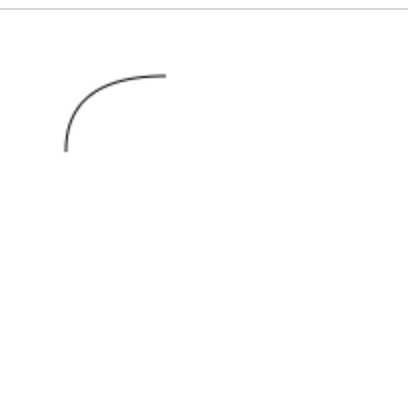|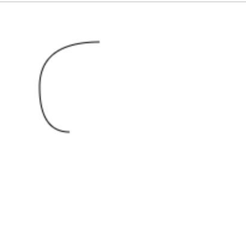|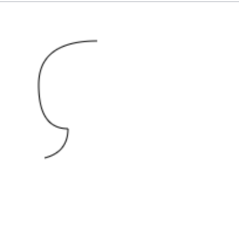|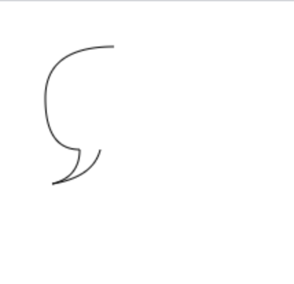|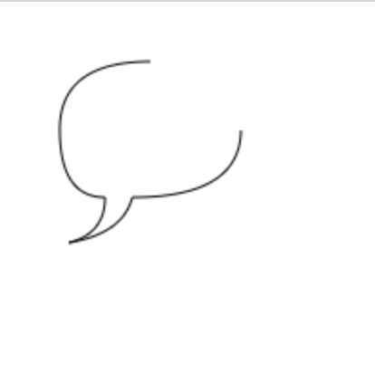|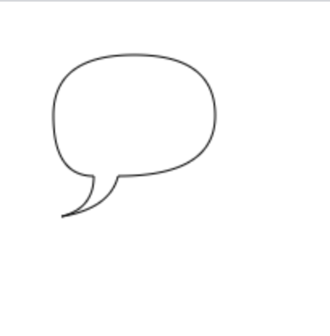|

三次贝塞尔曲线示例(绘制心形)

```html
<!DOCTYPE html>
<html>
	<head>
		<meta charset="utf-8" />
		<title>三次贝塞尔曲线</title>
	</head>
	<body>
		<canvas width="300px" height="150px" id="canvas"></canvas>
		<script type="text/javascript">
			function draw() {
				var canvas = document.getElementById('canvas');
				if (canvas.getContext) {
					var ctx = canvas.getContext('2d');

					//三次贝塞尔曲线
					ctx.beginPath();
					ctx.moveTo(75, 40); // 移动画笔点
					ctx.bezierCurveTo(75, 37, 70, 25, 50, 25);
					ctx.bezierCurveTo(20, 25, 20, 62.5, 20, 62.5);
					ctx.bezierCurveTo(20, 80, 40, 102, 75, 120);
					ctx.bezierCurveTo(110, 102, 130, 80, 130, 62.5);
					ctx.bezierCurveTo(130, 62.5, 130, 25, 100, 25);
					ctx.bezierCurveTo(85, 25, 75, 37, 75, 40);
					ctx.fill();
				}
			}
			draw()
		</script>
	</body>
</html>
```

| 第一次绘制 | 第二次绘制 | 第三次绘制 | 第四次绘制 | 第五次绘制 | 第六次绘制 |
| :----------------: | :--: | ---- | ---- | ---- | ---- |
|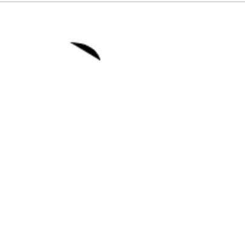|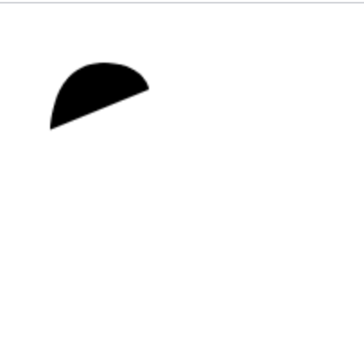|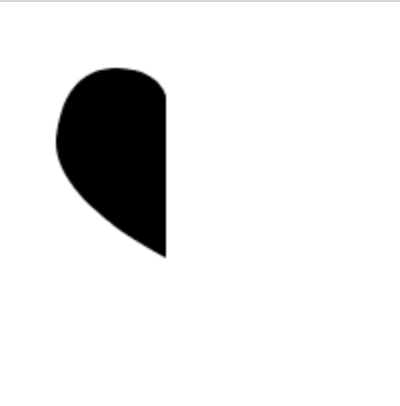|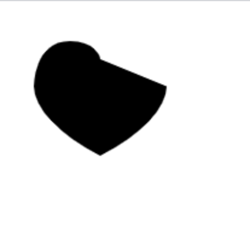|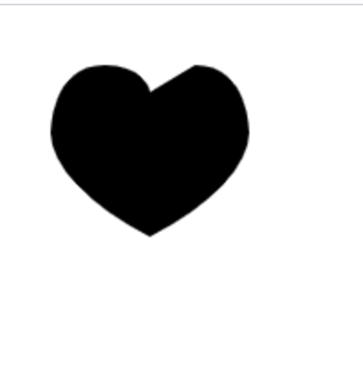|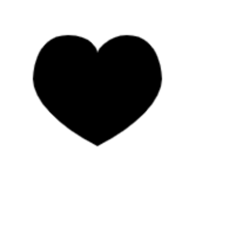|

