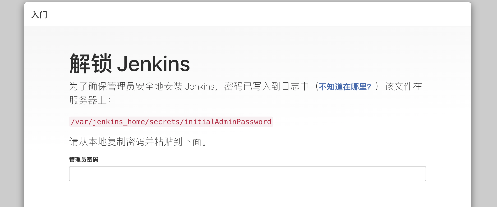
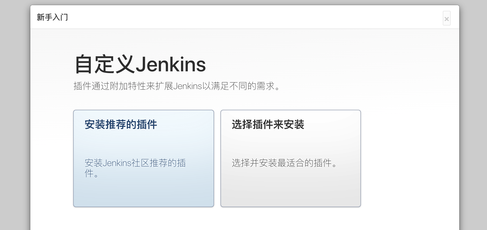
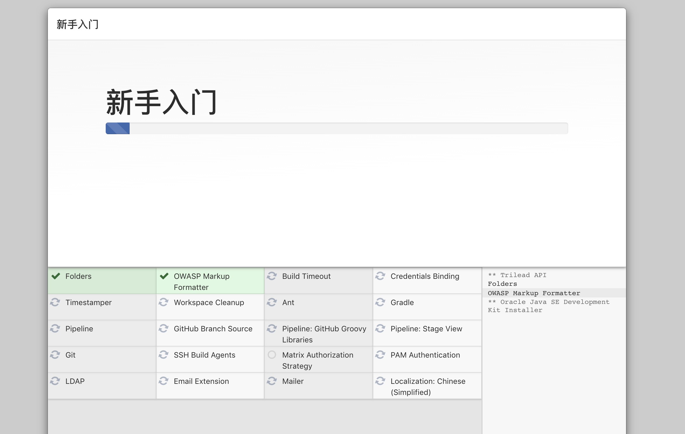
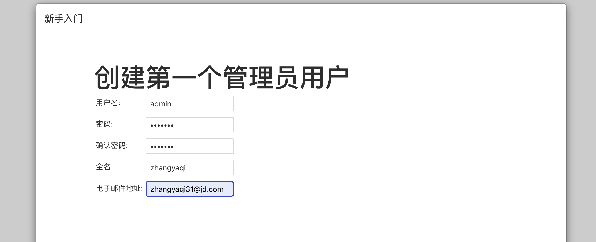

## 初识Jenkins

#### 一、什么是Jenkins？

Jenkins是一个自动化服务器，是一个成熟的CI工具，能够实现自动化集成发布。建立好流水线后，即可随时发布部署。

#### 二、运行容器
```shell
# -p 宿主机端口:镜像内部端口
# -v 宿主机的数据持久化地址:镜像内部映射地址
# -rm 可选项：关闭时自动删除docker容器
# $HOME = /Users/zhangyaqi31

docker run \
--name jenkins \
-d \
-p 9999:8080 \
-p 50000:50000 \
-v /Users/zhangyaqi31/dockerData/jenkins:/var/jenkins_home \
jenkins/jenkins:latest
```

运行之后Jenkins容器内`/var/jenkins_home`内地址就会映射到`/Users/zhangyaqi31/dockerData/jenkins`目录下。

#### 三、解锁Jenkins



如图，在访问`localhost:9999`后会出现如上界面，首次进入时需要输入验证密码。这里有两种方式可以查找，一种是在自己本机的映射目录下去查找，这种方式需要在创建容器的时候配置数据持久化。但如果在创建容器的时候没有设置数据持久化，则需要进入大容器中去查找。

```powershell
# 进入容器命令
docker exec -it containerID /bin/bash

cd /var/jenkins_home
```

四、安装插件



解锁 Jenkins之后，在 **Customize Jenkins** 页面内， 您可以安装任何数量的有用插件作为您初始步骤的一部分。选择建议安装插件即可，后续需要的插件可在页面内查找安装。

- **安装建议的插件** - 安装推荐的一组插件，这些插件基于最常见的用例.
- **选择要安装的插件** - 选择安装的插件集。当你第一次访问插件选择页面时，默认选择建议的插件。



#### 五、创建管理员用户



```json
username: admin
password: 1234567
```

以上创建完成即可开始使用Jenkins！！！

## 使用Jenkins

