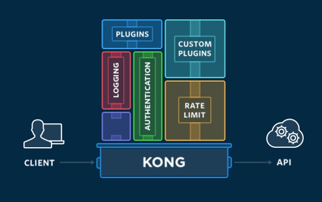
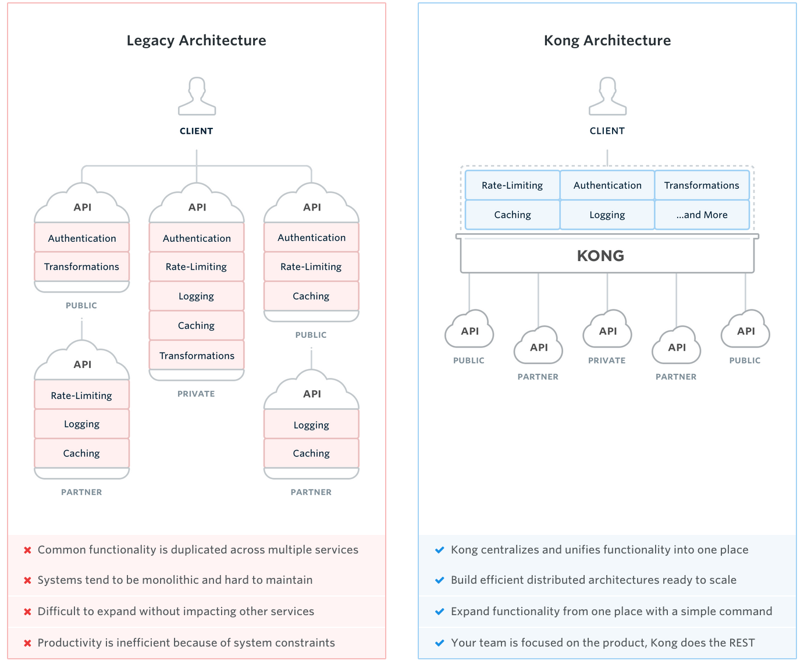

#### 一、API网关

API 网关，即API Gateway，是大型分布式系统中，为了保护内部服务而设计的一道屏障，可以提供高性能、高可用的 API托管服务，从而帮助服务的开发者便捷地对外提供服务，而不用考虑安全控制、流量控制、审计日志等问题，统一在网关层将安全认证，流量控制，审计日志，黑白名单等实现。网关的下一层，是内部服务，内部服务只需开发和关注具体业务相关的实现。网关可以提供API发布、管理、维护等主要功能。开发者只需要简单的配置操作即可把自己开发的服务发布出去，同时置于网关的保护之下。
————————————————
版权声明：本文为CSDN博主「常乐_smile」的原创文章，遵循 CC 4.0 BY-SA 版权协议，转载请附上原文出处链接及本声明。
原文链接：https://blog.csdn.net/li396864285/article/details/77371385

#### 二、什么是kong？
Kong是一款基于Nginx_Lua模块写的高可用，易扩展由Mashape公司开源的API Gateway项目。由于Kong是基于Nginx的，所以可以水平扩展多个Kong服务器，通过前置的负载均衡配置把请求均匀地分发到各个Server，来应对大批量的网络请求。

Kong采用插件机制进行功能定制，插件集（可以是0或n个）在API请求响应循环的生命周期中被执行。插件使用Lua编写，目前已有几个基础功能：HTTP基本认证、密钥认证、CORS（ Cross-origin Resource Sharing，跨域资源共享）、TCP、UDP、文件日志、API请求限流、请求转发以及nginx监控。

#### 三、kong有什么功能以及能做什么事情。

1）Analytics: Detailed data analytics to inspect, monitor and visualize your microservices traffic.
分析:详细的数据分析来检查、监视和可视化您的微服务流量。

2）Authentication: An authentication layer to protect your services and ensure only authorized access.
身份验证:一个身份验证层，用于保护您的服务并确保只有经过授权的访问。

3）Logging: Real-time and continuous logging of API request and response data.
日志记录:对API请求和响应数据进行实时和连续的日志记录。

4）Serverless: Deploy serverless functions without the need to restart or redeploy Kong.
无服务器:部署无服务器功能，不需要重新启动或重新部署Kong。

5）Traffic Control: Granular control over inbound and outbound API traffic, including the ability to throttle and restrict traffic as required.
流量控制:对入站和出站API流量的细粒度控制，包括根据需要控制和限制流量的能力。

6）Transformations: Handle request and response data transformations on the fly.
转换:动态地处理请求和响应数据转换。

#### 四、使用kong有什么样的好处？

参考文档：
https://www.cnkirito.moe/kong-introduction/

github地址：
https://github.com/Kong/kong