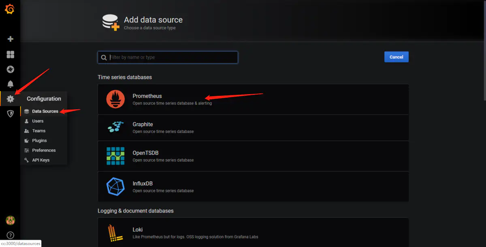
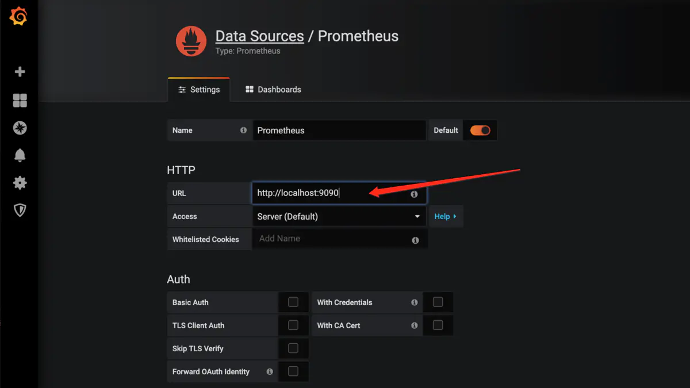
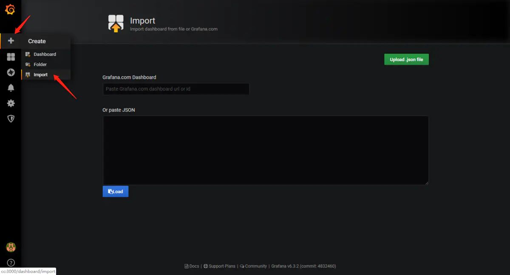
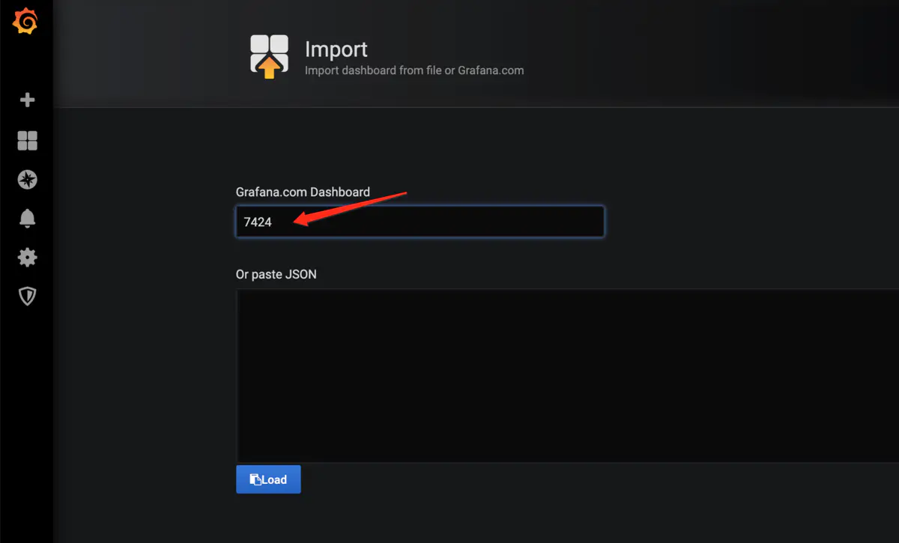
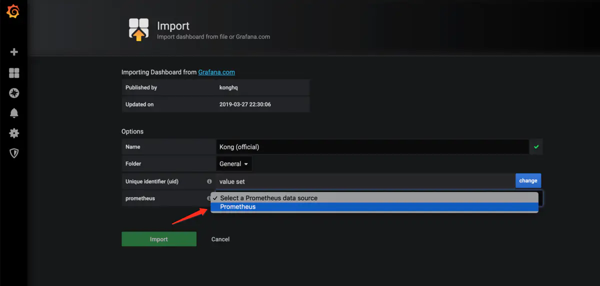

##### 1、什么是普罗米修斯监控
prometheus是一套开源的监控、报警、时间序列数据库的组合，适合监控docker容器，因k8s的流行带动了其发展。

##### 2、时间序列数据
按照时间顺序记录系统，设备状态变化的数据称之为时序数据。
运行场景：
1、无人驾驶记录经纬度、方向、速度、方便物体距离；
2、某个地区各个车辆的行驶轨迹数据；
3、传统证券行业实时交易数据；
4、实时运维监控数据。
特点：
1、性能好，非关系型数据库
2、存储成本低：高效压缩算法、节省存储空间

##### 3、prometheus特征
1、多维度数据模型
2、灵活的查询语言
3、不依赖分布式存储，单个服务器节点是自主的
4、以HTTP的形式，通过pull模型拉取时间序列数据
5、通过服务器发现或者静态配置，来发 现目标服务对象
6、支持多种多样的图表和界面展示 

##### 4、架构图


##### 5、环境准备工作
1、grafana服务器（运维成像=>数据转换成图形 ）
2、promethues服务器
3、被监控服务器
 
##### 6、安装prometheus
以docker的方式安装
```powershell
$ docker run --network=kong-net --name prometheus -d -p 0.0.0.0:9090:9090 prom/prometheus
```
执行之后即会在9090端口启动程序，可以在浏览器中访问localhost:9090来查看是否成功启动。
也可以通过  http://localhost:9090/metrics 来查看监控的数据
刚启动的程序，只监控了自己。

主意：后续需要在prometheus中添加远程主机的监控地址，所以需要能修改项目中的配置文件prometheus.yml，这样才能获取到监控到的内容。

##### 7、监控远程Linux主机
在远程的Linux主机上安装node_exporter组件，安装之后prometheus就可以监控这台机器的信息了，下载地址为：https://prometheus.io/download/
下载安装完成之后，在远程主机上启动该组件
```powershell
# 在9100端口启动程序
$ nohup $PATH/node_exporter & 
```
最后在浏览器上访问 http://被监控端IP:9100/metrics 就可以查看到被监控的数据。

##### 8、grafana告警系统
使用docker的方式安装
```powershell
$ docker run -d --name=grafana -p 3000:3000 grafana/grafana
```
安装完成之后即可在3000端口访问该内容
1、添加数据源

2、配置prometheus的信息

3、保存测试，绿色是成功，否则是有问题的配置。
4、通过import的方式添加一个dashboard

5、在ID处填入7424，这个是kong的官方模板

6、选择prometheus数据源

7、最后选择load，就会出现自动展示相关的表格内容。

##### 9、在konga中添加prometheus监控

截止到目前为止，之前的操作都是在虚拟机上创建多个机器来做的事情，其实kong api是支持添加prometheus插件支持的。具体的内容可以在kongaUI上添加全局的插件。

在prometheus的配置文件中，将kong api的域名和端口加在配置文件中，可以在prometheus给的页面查看是否成功添加kong的内容。

